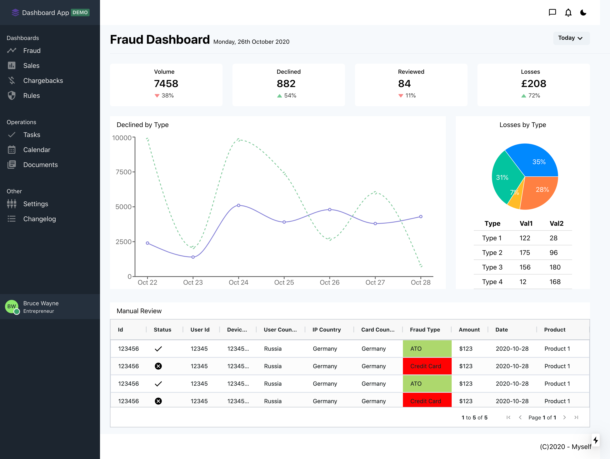

# Fraud Dashboard
[Live Demo](https://fraud-dashboard.vercel.app/)

A data analysis of cats available for adoption using Python web scraping, PostgreSQL, and Pandas.

## Overview
A fraud metrics and sales dashboard created with Next.js. Designed as a data visualization tool using charts and tables.

## Features
Live data is injested from JSON

### Dashboards
* Fraud Metrics
* Sales
* Chargebacks
* Rules/policies
### Operations
* Tasks
* Calendar
* Documents
### Other
* Settings
* Changelog
